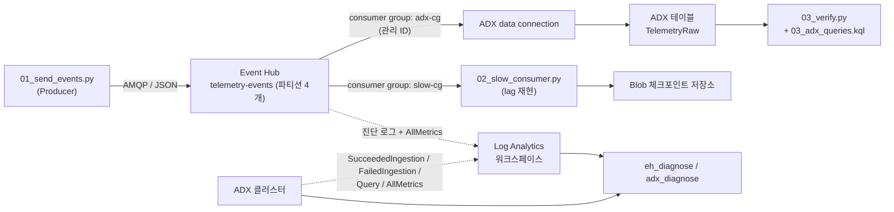

# Event Hub + ADX 진단 테스트 랩

**언어:** [English](./README.md) · 한국어(현재 파일)

Azure **Event Hubs**와 **Azure Data Explorer(ADX)**를 프로비저닝한 뒤,
**메트릭 / 파티션 스큐 / consumer lag / ingestion 실패 / mapping mismatch / 쿼리·스캔·캐시 부하** 같은
진단 신호를 **의도적으로 생성**하여, 진단 도구(예: `eh_diagnose` / `adx_diagnose`)를
재현 가능한 조건에서 검증하기 위한 셀프 테스트 랩입니다.

> ⚠️ 이 랩은 **과금되는 Azure 리소스**를 생성합니다(ADX 클러스터가 비용의 대부분).
> 세션 사이에는 `10_adx_stop_start.sh stop`, 종료 시에는 `99_cleanup.sh`로 정리하세요.

---

## 이 랩이 하는 일

- 종단 파이프라인 프로비저닝: **Producer → Event Hub → ADX data connection → `TelemetryRaw` 테이블**.
- Event Hubs와 ADX의 **진단 설정 + 메트릭**을 **Log Analytics 워크스페이스**로 전송.
- 정상 트래픽과 여러 장애 시나리오를 만드는 **Producer** 제공.
- **consumer lag**를 재현하는 **느린 Consumer**(영속 Blob 체크포인트) 제공.
- 기대 신호가 실제로 적재됐는지 확인하는 **검증 하네스**와 **KQL 쿼리 팩** 제공.

---

## 아키텍처



---

## 파일 구성

| 파일 | 역할 |
|---|---|
| `00_create_lab.sh` | 전체 랩 생성: Event Hubs, ADX 클러스터/DB, Log Analytics, Storage, 진단 설정, RBAC, 테이블 + JSON 매핑, ingestion batching 정책. `lab.env` 생성. |
| `01_send_events.py` | 테스트 이벤트 **Producer** — 모드: `normal / skew / burst / badjson / mismatch`; 옵션: `--backfill-hours`, `--auth aad`. |
| `02_slow_consumer.py` | consumer lag 재현용 **느린 Consumer**, Blob 체크포인트·Entra ID 인증 옵션. |
| `03_verify.py` | **검증 하네스** — ADX에 KQL 점검을 실행해 신호별 PASS/WARN/INFO 출력. |
| `03_adx_queries.kql` | ADX 웹 UI용 **수동 진단 쿼리**(스큐·실패·지연·캐시/콜드 스캔). |
| `04_adx_bulk_generate.kql` | 쿼리/스캔/캐시 성능 테스트용 **대량(수백만 행)** 데이터 생성. |
| `10_adx_stop_start.sh` | ADX 클러스터 start/stop(컴퓨트 비용 절감). |
| `99_cleanup.sh` | 리소스 그룹 전체 삭제. |
| `requirements.txt` | Python 의존성. |
| `README.md` / `README.ko.md` | 이 가이드(영어 / 한국어). |

---

## 사전 준비

- 리소스 생성 및 **역할 할당(RBAC)** 권한이 있는 **Azure 구독**.
- **Bash** 환경의 **Azure CLI**. 스크립트는 Bash이므로 **Azure Cloud Shell(Bash)** 또는 WSL/Linux/macOS를 사용하세요.
  > Windows PowerShell에서는 `.sh` 스크립트가 실행되지 않습니다. Cloud Shell 또는 WSL을 사용하세요.
- **Python 3.10+**.
- 로그인: `az login` (Cloud Shell은 자동).

---

## 빠른 시작

```bash
# 1) 랩 생성 (약 15~20분, ADX 클러스터 프로비저닝이 대부분)
chmod +x 00_create_lab.sh
./00_create_lab.sh                 # 성공 시 ./lab.env 생성

# (선택) RBAC 테스트를 위해 별도 ID/SP에 데이터플레인 권한 부여:
#   ADX_QUERY_PRINCIPAL="aadapp=<appId>;<tenantId>" ./00_create_lab.sh

# 2) Python 환경
source ./lab.env
python3 -m venv .venv
source .venv/bin/activate
pip install -r requirements.txt

# 3) 정상 트래픽 전송
python 01_send_events.py --mode normal --count 5000 --batch-size 100 --sleep-ms 100

# 4) ADX에 신호가 적재됐는지 검증
python 03_verify.py
```

ADX 쿼리 엔드포인트(생성 스크립트가 출력):
`https://<ADX_CLUSTER>.<LOCATION>.kusto.windows.net/databases/<ADX_DB>`

---

## 시나리오 → 기대 신호 매트릭스

| 시나리오 | 실행 명령 | 기대 진단 신호 |
|---|---|---|
| 정상 수집 | `python 01_send_events.py --mode normal --count 5000` | `TelemetryRaw`에 적재, 정상 ingestion 지연 |
| 파티션 스큐 | `python 01_send_events.py --mode skew --count 10000` | 특정 `PartitionKey` 편중 → skew 신호 |
| consumer lag | `python 02_slow_consumer.py --sleep-seconds 2 --checkpoint-every 100` | `slow-cg` 소비 지연, 백로그 증가 |
| bad JSON | `python 01_send_events.py --mode badjson --count 1000` | ingestion 실패 (`.show ingestion failures`) |
| mapping mismatch | `python 01_send_events.py --mode mismatch --count 1000` | type/mapping ingestion 실패 |
| burst / throttling | `python 01_send_events.py --mode burst --count 50000 --batch-size 500` | TU 초과 시 throttling(429)/server error 메트릭 |
| 쿼리 / 스캔 / 캐시 | `04_adx_bulk_generate.kql` 실행 후 `03_adx_queries.kql` | hot vs cold 스캔 시간 차이, capacity/cache 지표 |

각 시나리오 실행 후 `python 03_verify.py`로 결과를 확인하세요.

---

## 인증 모드 (RBAC 테스트)

- **기본:** SAS 커넥션 스트링(`EH_CONN_STR`, `lab.env`에 설정됨).
- **Entra ID:** Producer/Consumer에 `--auth aad` 추가(`DefaultAzureCredential` 사용).
  - 송신 ID에 **Azure Event Hubs Data Sender**, 수신 ID에 **Data Receiver** 역할 필요.
  - 역할을 일부러 부여하지 않아 "권한 거부" 케이스를 만들면 진단 도구의 RBAC 탐지도 검증 가능.

```bash
python 01_send_events.py --mode normal --count 1000 --auth aad
python 02_slow_consumer.py --auth aad
```

---

## 캐시 vs 콜드 스캔 주의 (중요)

ADX hot-cache는 **ingestion 시점(extent 나이)** 기준이며 `Timestamp` 컬럼 값이 **아닙니다**.
**콜드 스캔**을 강제하려면 hot-cache 창을 없애세요(`03_adx_queries.kql` 참고):

```kusto
.alter table TelemetryRaw policy caching hot = 0d   // 콜드 강제
.alter table TelemetryRaw policy caching hot = 1d   // hot 복원
```

`--backfill-hours`는 **시간 범위/볼륨** 쿼리를 위한 것이며, 그 자체로 콜드 데이터를 만들지는 않습니다.

---

## 관측 소스 (진단 도구가 읽는 대상)

- **Azure Monitor 메트릭:** Event Hubs `AllMetrics`, ADX `AllMetrics`(둘 다 Log Analytics로 전송).
- **Log Analytics 로그:** Event Hubs Operational/RuntimeAudit; ADX Succeeded/FailedIngestion, IngestionBatching, Command, Query, TableUsageStatistics.
- **컨트롤 플레인:** `.show ingestion failures`, `.show capacity`, `.show queries`.
- **RBAC:** Event Hubs Data Receiver(ADX 관리 ID) + 선택적 ADX DB principal.

---

## 구성 (환경 변수)

`00_create_lab.sh` 실행 전에 설정(모두 선택 사항, 합리적 기본값 제공):

| 변수 | 기본값 | 비고 |
|---|---|---|
| `LOCATION` | `koreacentral` | Azure 리전 |
| `SUFFIX` | `date +%m%d%H%M` | 고정값으로 두면 리소스 이름이 안정적으로 유지됨 |
| `ADX_SKU_NAME` | `Standard_D11_v2` | 리전/구독에서 미가용이면 오버라이드 |
| `ADX_SKU_TIER` | `Standard` | `Standard` 또는 `Basic` |
| `ADX_CAPACITY` | `2` | ADX 인스턴스 수 |
| `ADX_QUERY_PRINCIPAL` | *(비어 있음)* | 추가 ADX DB admin principal, 예: `aadapp=<appId>;<tenantId>` |

Producer 플래그: `--mode {normal,skew,burst,badjson,mismatch}`, `--count`, `--batch-size`, `--sleep-ms`, `--backfill-hours`, `--auth {connstr,aad}`, `--namespace-fqdn`.
Consumer 플래그: `--sleep-seconds`, `--checkpoint-every`, `--consumer-group`, `--auth {connstr,aad}`, `--namespace-fqdn`, `--no-checkpoint-store`.

---

## 비용 관리 & 정리

```bash
# 세션 사이 ADX 컴퓨트 일시정지
chmod +x 10_adx_stop_start.sh
./10_adx_stop_start.sh stop
./10_adx_stop_start.sh start
./10_adx_stop_start.sh status

# 전체 삭제
chmod +x 99_cleanup.sh
./99_cleanup.sh
```

---

## 문제 해결

- **Windows에서 `.sh`가 실행 안 됨** → Azure Cloud Shell(Bash) 또는 WSL 사용.
- **ADX SKU 미가용** → `ADX_SKU_NAME`을 해당 리전/구독에서 가용한 SKU로 설정.
- **RBAC가 즉시 적용되지 않음** → 역할 할당 전파에 수 분 소요될 수 있음.
- **ADX에 아직 데이터 없음** → ADX는 큐드 인제스트 방식. 30초 batching 정책 기준 전송 후 약 1분 대기.
- **`03_verify.py` 인증 오류** → `az login` 실행. ADX 쿼리 엔드포인트에 Azure CLI 자격 증명을 사용함.

---

## 참고

- 이 랩은 **테스트/PoC**용입니다. 프로덕션 리소스를 대상으로 하지 마세요.
- 샘플 데이터는 합성된 가상 데이터입니다.
