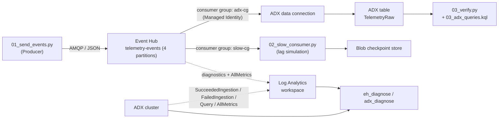

# Event Hub + ADX Diagnostic Test Lab

**Languages:** English (this file) · [한국어](./README.ko.md)

A self-contained lab that provisions Azure **Event Hubs** and **Azure Data Explorer (ADX)** and then
**intentionally generates diagnostic signals** — metrics, partition skew, consumer lag, ingestion
failures, mapping mismatch, and query/scan/cache load — so you can validate diagnostic tooling
(e.g. `eh_diagnose` / `adx_diagnose`) against known, reproducible conditions.

> ⚠️ This lab creates **billable Azure resources** (an ADX cluster is the main cost driver).
> Use `Scripts_Linux/10_adx_stop_start.sh stop` (or `Scripts_windows\10_adx_stop_start.ps1 -Action stop`) between sessions and the cleanup script when finished.

---

## What the lab does

- Provisions an end-to-end telemetry pipeline: **Producer → Event Hub → ADX data connection → `TelemetryRaw` table**.
- Wires **diagnostic settings + metrics** for both Event Hubs and ADX into a **Log Analytics workspace**.
- Provides a **producer** that can emit normal traffic and several fault scenarios.
- Provides a **slow consumer** (with durable Blob checkpointing) to reproduce **consumer lag**.
- Provides a **verification harness** and **KQL query packs** to confirm the expected signals landed.

---

## Architecture



---

## Repository structure

```
Event_hub_ADX_Test_Lab/
├─ Scripts_Linux/            # Bash provisioning (Cloud Shell / WSL / Linux / macOS)
│  ├─ 00_create_lab.sh       # provisions the whole lab; writes lab.env
│  ├─ 10_adx_stop_start.sh   # start/stop ADX cluster (cost control)
│  └─ 99_cleanup.sh          # delete the resource group
├─ Scripts_windows/          # PowerShell provisioning (Windows)
│  ├─ 00_create_lab.ps1      # provisions the whole lab; writes lab.ps1
│  ├─ 10_adx_stop_start.ps1
│  └─ 99_cleanup.ps1
├─ 01_send_events.py         # Producer: normal/skew/burst/badjson/mismatch, --backfill-hours, --auth aad
├─ 02_slow_consumer.py       # Slow consumer for consumer-lag (Blob checkpoint, --auth aad)
├─ 03_verify.py              # Assertion harness: KQL checks -> PASS/WARN/INFO
├─ 03_adx_queries.kql        # Manual diagnostic queries (skew, failures, latency, cache/cold)
├─ 04_adx_bulk_generate.kql  # Bulk synthetic rows for query/scan/cache perf
├─ requirements.txt          # Python dependencies
├─ README.md / README.ko.md  # this guide (English / Korean)
└─ (generated) lab.env / lab.ps1   # env vars from the create script — gitignored
```

**The create script** (`Scripts_Linux/00_create_lab.sh` or `Scripts_windows/00_create_lab.ps1`) provisions
Event Hubs, the ADX cluster/DB, Log Analytics, Storage, diagnostic settings, RBAC, the table + JSON mapping,
and the ingestion batching policy.

> **Run all commands from the repository root** so that `lab.env` / `lab.ps1` and the generated
> `adx_init.kql` land next to the Python scripts.

---

## Prerequisites

- **Azure subscription** with permission to create resources **and assign roles (RBAC)**.
- **Azure CLI**. Use the **Bash** scripts in `Scripts_Linux/` (Azure Cloud Shell / WSL / Linux / macOS) **or** the **PowerShell** scripts in `Scripts_windows/` (Windows).
- **Python 3.10+**.
- Signed in: `az login` (automatic in Cloud Shell).

---

## Quick start (Linux / macOS / Cloud Shell — Bash)

> Run from the repository root.

```bash
# 1) Provision the lab (~15–20 min; ADX cluster provisioning dominates)
chmod +x Scripts_Linux/*.sh
./Scripts_Linux/00_create_lab.sh   # creates ./lab.env on success

# (optional) also grant a separate identity/SP data-plane access for RBAC tests:
#   ADX_QUERY_PRINCIPAL="aadapp=<appId>;<tenantId>" ./Scripts_Linux/00_create_lab.sh

# 2) Python environment
source ./lab.env
python3 -m venv .venv
source .venv/bin/activate
pip install -r requirements.txt

# 3) Send normal traffic
python 01_send_events.py --mode normal --count 5000 --batch-size 100 --sleep-ms 100

# 4) Verify the signals landed in ADX
python 03_verify.py
```

### Windows (PowerShell)

The `.sh` scripts have PowerShell equivalents (`.ps1`). Run them from PowerShell with Azure CLI installed and `az login` done:

```powershell
# 1) Provision the lab (creates .\lab.ps1). Run from the repository root.
.\Scripts_windows\00_create_lab.ps1

# 2) Load env vars + Python environment
. .\lab.ps1                       # dot-source (leading dot + space)
python -m venv .venv
.\.venv\Scripts\Activate.ps1
pip install -r requirements.txt

# 3) Send traffic and verify
python 01_send_events.py --mode normal --count 5000
python 03_verify.py

# cost control / cleanup
.\Scripts_windows\10_adx_stop_start.ps1 -Action stop
.\Scripts_windows\99_cleanup.ps1
```
> If script execution is blocked: `Set-ExecutionPolicy -Scope Process -ExecutionPolicy Bypass`.

ADX query endpoint (also printed by the create script):
`https://<ADX_CLUSTER>.<LOCATION>.kusto.windows.net/databases/<ADX_DB>`

---

## Scenario → expected signal matrix

| Scenario | Command | Expected diagnostic signal |
|---|---|---|
| Normal ingestion | `python 01_send_events.py --mode normal --count 5000` | Rows land in `TelemetryRaw`; normal ingestion latency |
| Partition skew | `python 01_send_events.py --mode skew --count 10000` | One `PartitionKey` dominates → skew signal |
| Consumer lag | `python 02_slow_consumer.py --sleep-seconds 2 --checkpoint-every 100` | `slow-cg` falls behind; backlog grows |
| Bad JSON | `python 01_send_events.py --mode badjson --count 1000` | Ingestion failures (`.show ingestion failures`) |
| Mapping mismatch | `python 01_send_events.py --mode mismatch --count 1000` | Type/mapping ingestion failures |
| Burst / throttling | `python 01_send_events.py --mode burst --count 50000 --batch-size 500` | Throttling (429) / server-error metrics when TU is exceeded |
| Query / scan / cache | run `04_adx_bulk_generate.kql` then `03_adx_queries.kql` | Hot vs cold scan time difference; capacity/cache metrics |

Run `python 03_verify.py` after each scenario to assert the outcome.

---

## Authentication modes (RBAC testing)

- **Default:** SAS connection string (`EH_CONN_STR`, set by `lab.env`).
- **Entra ID:** add `--auth aad` to the producer/consumer (uses `DefaultAzureCredential`).
  - Sending identity needs **Azure Event Hubs Data Sender**; receiving identity needs **Data Receiver**.
  - Intentionally omit a role to create a "permission denied" case and confirm the diagnostic tool detects it.

```bash
python 01_send_events.py --mode normal --count 1000 --auth aad
python 02_slow_consumer.py --auth aad
```

---

## Cache vs cold-scan note (important)

ADX hot-cache is based on the **ingestion time (extent age)**, **not** the `Timestamp` column value.
To force a **cold scan**, drop the hot-cache window (see `03_adx_queries.kql`):

```kusto
.alter table TelemetryRaw policy caching hot = 0d   // force cold
.alter table TelemetryRaw policy caching hot = 1d   // restore hot
```

`--backfill-hours` is for **time-range/volume** queries; it does **not** by itself create cold data.

---

## Observation sources (what the diagnostic tools read)

- **Azure Monitor metrics:** Event Hubs `AllMetrics`, ADX `AllMetrics` (both routed to Log Analytics).
- **Log Analytics logs:** Event Hubs Operational/RuntimeAudit; ADX Succeeded/FailedIngestion, IngestionBatching, Command, Query, TableUsageStatistics.
- **Control plane:** `.show ingestion failures`, `.show capacity`, `.show queries`.
- **RBAC:** Event Hubs Data Receiver (ADX managed identity) + optional ADX DB principal.

---

## Configuration (environment variables)

Set before running the create script (all optional; sensible defaults provided):

| Variable | Default | Notes |
|---|---|---|
| `LOCATION` | `koreacentral` | Azure region |
| `SUFFIX` | `date +%m%d%H%M` | Reuse a fixed value to keep stable resource names |
| `ADX_SKU_NAME` | `Standard_D11_v2` | Override if unavailable in your region/subscription |
| `ADX_SKU_TIER` | `Standard` | `Standard` or `Basic` |
| `ADX_CAPACITY` | `2` | ADX instance count |
| `ADX_QUERY_PRINCIPAL` | *(empty)* | Extra ADX DB admin principal, e.g. `aadapp=<appId>;<tenantId>` |

Producer flags: `--mode {normal,skew,burst,badjson,mismatch}`, `--count`, `--batch-size`, `--sleep-ms`, `--backfill-hours`, `--auth {connstr,aad}`, `--namespace-fqdn`.
Consumer flags: `--sleep-seconds`, `--checkpoint-every`, `--consumer-group`, `--auth {connstr,aad}`, `--namespace-fqdn`, `--no-checkpoint-store`.

---

## Cost management & cleanup

```bash
# Linux / Bash — pause ADX compute between sessions
chmod +x Scripts_Linux/*.sh
./Scripts_Linux/10_adx_stop_start.sh stop
./Scripts_Linux/10_adx_stop_start.sh start
./Scripts_Linux/10_adx_stop_start.sh status

# Delete everything
./Scripts_Linux/99_cleanup.sh
```
```powershell
# Windows / PowerShell
.\Scripts_windows\10_adx_stop_start.ps1 -Action stop
.\Scripts_windows\99_cleanup.ps1
```

---

## Troubleshooting

- **`.sh` won't run on Windows** → use the PowerShell scripts in `Scripts_windows/`, or run the Bash scripts in Azure Cloud Shell / WSL.
- **ADX SKU not available** → set `ADX_SKU_NAME` to a SKU available in your region/subscription.
- **RBAC not effective immediately** → role assignments can take a few minutes to propagate.
- **No rows in ADX yet** → ADX uses queued ingestion; with the 30s batching policy allow ~1 min after sending.
- **`03_verify.py` auth error** → run `az login`; it uses Azure CLI credentials against the ADX query endpoint.

---

## Notes

- The lab is intended for **testing/PoC**. Do not point it at production resources.
- Sample data is synthetic and fictitious.
